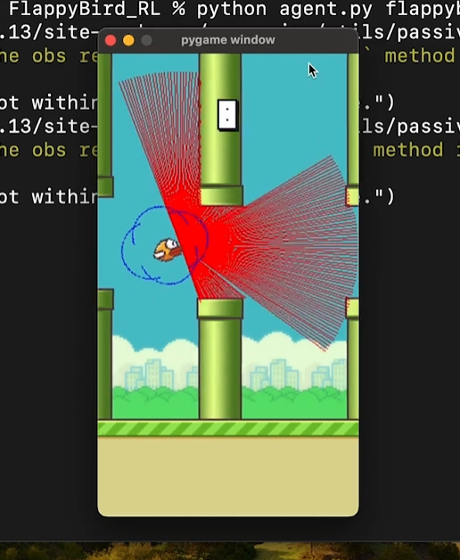

# 🐦 FlapNet: Deep Q-Learning for Flappy Bird

> DQN-based reinforcement learning agent that learns to play Flappy Bird using PyTorch.

---

## 🚀 Overview

FlapNet implements a **Deep Q-Network (DQN)** with:
- Experience Replay  
- Target Networks  
- Epsilon-Greedy Exploration  

The agent learns optimal flight control in the Flappy Bird environment through reinforcement learning.

---

## 🖼️ Demo



---

## 🧠 Features

- Deep Q-Network (DQN)  
- Experience Replay  
- Target Network  
- Epsilon-Greedy Strategy  
- YAML-based Hyperparameter Configuration  

---

## 📁 Project Structure

```
├── agent.py
├── dqn.py
├── experience_replay.py
├── parameters.yaml
└── runs/
```

---

## ⚙️ Installation

Install the required dependencies:

```bash
pip install torch gymnasium flappy-bird-gymnasium pyyaml
```

---

## ▶️ Usage

### 🔹 Train the Agent

```bash
python agent.py <param_set> --train
```

### 🔹 Test the Agent

```bash
python agent.py <param_set>
```

---

## ⚡ Tech Stack

- PyTorch  
- Gymnasium  
- Python  

---

## 👤 Author

**Abhishek Marigeri**

---
